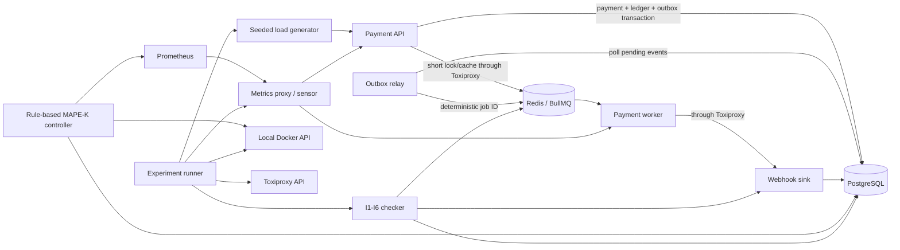

# Chaos Harness

Chaos Harness is a local chaos-engineering system that tests both service recovery and
financial correctness in a sample payment workflow. It injects controlled failures,
records the response, and then verifies the final state with six business invariants.

Version 1.0.0 is feature-complete for its declared local Docker Compose scope. It is a
portfolio and learning system, not a production payment processor or remote chaos tool.

## Why this project exists

A process becoming healthy after restart does not prove that its data is correct. A
payment system can recover while losing a committed event, duplicating a side effect, or
returning success for data that later disappears. This project keeps recovery evidence
and correctness evidence separate.

The runner preserves this chain for every experiment:

`experiment config -> client journal -> fault timeline -> response events -> database,
queue, and sink checks -> final report`

No baseline, timing, or defect claim below is inferred from code alone; every measured
claim names a preserved run or matrix ID.

## Architecture



| Area            | Implementation                                                                   |
| --------------- | -------------------------------------------------------------------------------- |
| Managed system  | Payment API, PostgreSQL ledger/outbox, Redis/BullMQ, relay, worker, webhook sink |
| Observability   | Prometheus plus an independently disruptable/corruptible metrics proxy           |
| Managing system | Rule-based MAPE-K controller with policy, hysteresis, cooldown, and rate limits  |
| Faults          | FS-1 service state, FS-2 telemetry corruption, FS-3 sensor loss, FS-4 TCP faults |
| Evidence        | Seeded client journal, JSONL timeline, response timings, I1-I6, JSON report      |
| Safety          | Local Docker only, exact Compose target, mutation label, lock, deadline, revert  |

The current Compose topology has nine healthy services. The controller, load generator,
invariant checker, runner, and matrix reporter run as host processes.

## Correctness contracts

| ID  | Contract                                                                                    |
| --- | ------------------------------------------------------------------------------------------- |
| I1  | One payment per idempotency key and one payment identity across successful replays          |
| I2  | Debits equal credits per payment and globally                                               |
| I3  | Every acknowledged payment still exists                                                     |
| I4  | Payments and ledger entries have complete referential coverage                              |
| I5  | Every payment committed in the run window is delivered or dead-lettered after draining      |
| I6  | Duplicate transport deliveries are counted; unexplained control-run duplicates fail the run |

I1/I2 are always strict. I6 is report-only after a real injected fault because BullMQ is
at-least-once; duplicate delivery is acceptable, but duplicate financial effect is not.

## Verified results

### Repeated matrices

Day 17 matrix `day17-full-matrix-2026-10-05T02-30-14-956Z-59fb7c3c` completed all 130
planned runs across 13 experiment configurations. The two failures were both I5
reproductions of F-001 before its fix; all other 128 reports passed. All ten controls
passed I1-I6, I1-I4 passed in all 130 runs, and all 50 corrupt-telemetry assessments
recorded zero controller actions and zero false actions.

| Fault | Runs | Passed | Failed | MTTD median / p90 | MTTR median / p90  | Client p95 median / p90 |
| ----- | ---: | -----: | -----: | ----------------- | ------------------ | ----------------------- |
| none  |   10 |     10 |      0 | not applicable    | not applicable     | 31 / 36 ms              |
| FS-1  |   40 |     38 |      2 | 632 / 872 ms      | 7,085 / 8,706 ms   | 39 / 117 ms             |
| FS-2  |   50 |     50 |      0 | missing           | 26,107 / 27,638 ms | 31 / 34 ms              |
| FS-3  |   10 |     10 |      0 | missing           | 16,081 / 16,785 ms | 34 / 37 ms              |
| FS-4  |   20 |     20 |      0 | missing           | 8,829 / 11,143 ms  | 1,022 / 2,015 ms        |

Only the ten controller-enabled FS-1 runs emitted an application anomaly, so all other
MTTD samples remain explicitly missing rather than being replaced with zero.

Day 18 matrix `day18-gap-matrix-2026-10-05T03-43-56-583Z-d6c0aea6` added 30 peak/gap
runs: Redis outage, controller replacement during a worker outage, and PostgreSQL-path
latency. All 30 reports and all I1-I6 outcomes passed; all ten controller-restart
assessments passed. Redis and database latency caused real client failures, so these are
correctness results—not claims of uninterrupted availability.

### Finding and fix proof

| ID    | Genuine observation                                                                         | Resolution and proof                                                               |
| ----- | ------------------------------------------------------------------------------------------- | ---------------------------------------------------------------------------------- |
| F-001 | API SIGKILL exposed commit-before-enqueue event loss; four payments lacked a terminal event | Transactional outbox + relay; unchanged seed-301 reproducer passed I1-I6 after fix |
| F-002 | Reused seeded idempotency keys contaminated evidence across runs                            | Run-ID namespacing and delayed I6 observation; fixed run preserved                 |

F-001 before run:
`kill-api-after-commit-2026-10-04T03-43-44-836Z-2b69c248`.

F-001 after run:
`kill-api-after-commit-2026-10-05T04-07-33-206Z-e4ca8f09`. Its run window contained 201
payments, 201 matching outbox rows, and 201 published rows; I5 found no missing terminal
event for 192 acknowledged payments.

S-001 is deliberately synthetic: it plants a non-idempotent consumer to prove the tester
detects a duplicate side effect. It is never presented as a discovered defect.

### Final smoke and tests

One-command run `ci-smoke-worker-kill-2026-10-05T04-24-22-895Z-9fce2893` injected a
real worker SIGKILL, completed 49/49 operations, passed I1-I6 for 47 unique acknowledged
payments, and recorded 4,852 ms unhealed MTTR. All fault surfaces were clean afterward.

- 94 unit tests and 10 live PostgreSQL/Redis integration tests pass.
- Lint, formatting, strict TypeScript, Compose validation, and workflow YAML validation
  pass locally.
- GitHub Actions is configured for quality, integration, smoke evidence upload, and
  cleanup. A hosted run is not claimed until this commit is pushed and the workflow runs.

See [matrix evidence](docs/matrix.md),
[F-001](docs/findings/F-001-commit-before-enqueue-event-loss.md),
[F-002](docs/findings/F-002-cross-run-evidence-contamination.md), and the
[synthetic scenario](docs/synthetic/S-001-non-idempotent-webhook-consumer.md).

## Quick start

Requirements: Docker Desktop with Linux containers, Node.js 24, and npm 12 or compatible.

```sh
npm ci
npm run demo
```

The demo starts dependencies, applies migrations, builds the nine-service stack, injects
the bounded worker-kill smoke fault, and preserves its report. It leaves the stack up for
inspection:

```sh
docker compose ps
docker compose logs --tail 100 payment-worker outbox-relay
docker compose down
```

`docker compose down` preserves volumes. Do not add `-v` unless deleting local
PostgreSQL, Redis, and Prometheus data is intentional.

For manual startup, every component command, health endpoint, experiment, matrix, and
diagnostic path is in the [current startup runbook](docs/handover/01-current-startup-runbook.md).

## Repository map

| Path            | Purpose                                                         |
| --------------- | --------------------------------------------------------------- |
| `services/`     | API, outbox relay, worker, sink, and metrics proxy              |
| `packages/`     | Shared config, PostgreSQL/Prisma layer, and queue contract      |
| `harness/`      | Load generation, invariants, runner, controller, matrix tooling |
| `experiments/`  | Versioned control and fault hypotheses                          |
| `infra/`        | Prometheus rules and Toxiproxy path definitions                 |
| `docs/results/` | Preserved per-run and aggregate evidence                        |
| `.github/`      | CI, dependency review, and Dependabot                           |

## Safety and limitations

- Local Docker Compose only; remote Docker hosts and production targets are refused.
- Docker API access is host-root-equivalent. Labels reduce accidental selection but are
  not an operating-system security boundary.
- PostgreSQL remains outside direct container mutation so correctness evidence survives;
  database-path faults use the allowlisted API-to-PostgreSQL Toxiproxy boundary.
- Toxiproxy provides TCP-stream latency, timeout, and reset behavior—not true packet loss.
- The controller is rule-based; there is no ML in the critical path.
- The measurements are functional development evidence, not production capacity or SLO
  claims.
- `npm audit` reports four high transitive advisories in the Prisma CLI toolchain. The
  offered forced fix downgrades to incompatible Prisma 6.19.3, so it is not applied.
- No LICENSE has been selected, by explicit project decision.

Read the full [safety model](docs/safety.md) and [extension contract](docs/extending.md)
before adding a target or fault adapter.

## Documentation

- [Project introduction](docs/handover/00-project-introduction.md)
- [Current startup runbook](docs/handover/01-current-startup-runbook.md)
- [Day-by-day implementation](docs/handover/02-day-by-day-implementation.md)
- [Study and debugging guide](docs/handover/03-study-guide.md)
- [Application ownership guide](docs/ownership-guide.md)
- [Most challenging parts and improvements](docs/challenges-and-improvements.md)
- [Deep interview and debugging questions](docs/interview-questions.md)
- [Hands-on rebuild labs](docs/rebuild-labs.md)
- [Ownership checklist and incident drills](docs/ownership-checklist.md)
- [Transactional outbox operations](docs/outbox.md)
- [Demo recording script](docs/demo-script.md)
- [Verified resume bullets](docs/resume-bullets.md)
- [v1.0.0 release notes](CHANGELOG.md)
