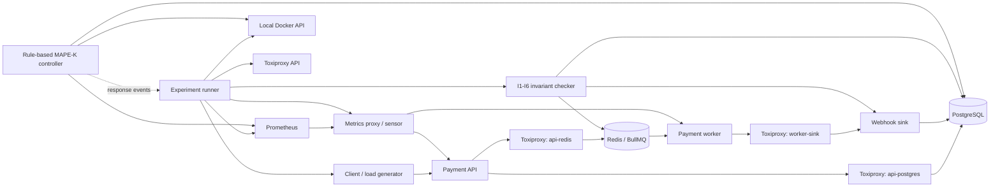

# Project introduction

## What this project is

Chaos Harness is a local chaos-engineering system for testing a small payment service
and the rule-based controller that recovers it. It deliberately asks two separate
questions after a fault:

1. Did the service recover?
2. Did the payment data remain financially correct?

Many demonstrations stop after proving that a process restarted or an endpoint became
healthy. That is not enough for a payment workflow: a recovered service can still have
lost a committed event, duplicated a financial effect, or acknowledged data that later
disappeared. This project treats recovery and correctness as separate outcomes and
stores evidence for both.

The project is a portfolio system, not a production payment processor. It demonstrates
distributed-systems reasoning, database-enforced invariants, observability, safe fault
injection, automated recovery, and evidence-based debugging using only local services.

## Why we are building it

The central problem is that restart, retry, and self-healing logic is often assumed to
work but is rarely tested under controlled failure. In financial software, an incorrect
recovery can be worse than an outage. The harness therefore creates repeatable failures,
measures the response, and verifies the final state instead of relying on a green health
check alone.

The design is influenced by the CHESS idea of testing the managing system as well as the
managed application. The controller follows MAPE-K: Monitor, Analyze, Plan, Execute over
a Knowledge store. The payment services and the controller are structurally separate so
the experiment can test either side without hiding direct coupling between them.

## Current architecture

### Managed system

- The payment API accepts idempotent payment requests.
- PostgreSQL is the source of truth and enforces ledger rules.
- Redis is a fast path and the BullMQ backing store, not the financial authority.
- The API enqueues a webhook job after committing the payment.
- A separate worker retries delivery to a webhook sink and dead-letters exhausted jobs.
- Prometheus scrapes API and worker metrics through a pass-through sensor proxy.

### Managing and experimental system

- The runner validates YAML and performs
  `preflight -> baseline -> inject -> observe -> revert -> recover -> verify -> report`.
- The safety layer restricts Docker actions to local, labeled Compose targets.
- FS-1 injects service outages through Docker.
- FS-3 stops the metrics sensor so controller behavior under missing telemetry is tested.
- FS-4 injects TCP latency, jitter, timeout, and connection resets through Toxiproxy.
- The controller uses PostgreSQL-backed policies, hysteresis, cooldowns, and restart
  limits to restart a failed worker safely. Missing telemetry enters blind mode and falls
  back to independently observed Docker state.
- The response tracker records fault, detection, plan, action, and recovery events.
- The invariant checker evaluates I1-I6 after the experiment.

## What makes the project useful

The main differentiator is its evidence chain:

`experiment config -> client journal -> fault timeline -> controller events -> database,
queue, and sink checks -> final report`

Every measured claim is tied to a run ID and preserved artifact. A report may show that
correctness invariants passed while availability was poor; the project does not rename
that outcome as resilience. Synthetic corruption used to prove the checker is kept
separate from genuine findings.

## Current verified state

Plan milestones Day 1 through Day 15 are implemented. The repository currently has:

- eight healthy Docker Compose services;
- 54 unit tests and 10 integration tests passing;
- an idempotent payment API, balanced ledger, queue worker, sink, and Prometheus metrics;
- reproducible load generation and I1-I6 checks;
- a safe experiment runner with FS-1, FS-3, and FS-4;
- a response tracker and rule-based MAPE-K worker-restart controller;
- two genuine findings and one explicitly synthetic scenario.

The genuine findings are:

- F-001: a committed payment can lose its webhook event if the API dies between database
  commit and queue enqueue.
- F-002: stable idempotency keys across repeated seeded runs contaminated later evidence;
  generated keys are now namespaced by run ID.

S-001 deliberately models a non-idempotent webhook consumer. It is a teaching fixture,
not a discovered defect.

## Current boundaries

- Local Docker Compose only; no production or remote Docker targets.
- Rule-based controller only; no ML in the critical path.
- Toxiproxy provides TCP-stream faults, not true packet loss.
- Results are functional development evidence, not production capacity claims.
- Aggregate N>=10 statistics, FS-2 telemetry corruption, the transactional outbox fix,
  final CI smoke runs, and v1 polish are still pending.
- No LICENSE has been selected yet, by explicit project decision.

Read next:

- `01-current-startup-runbook.md` to run the current system.
- `02-day-by-day-implementation.md` for implemented and remaining milestones.
- `03-study-guide.md` for the concepts and debugging path.
